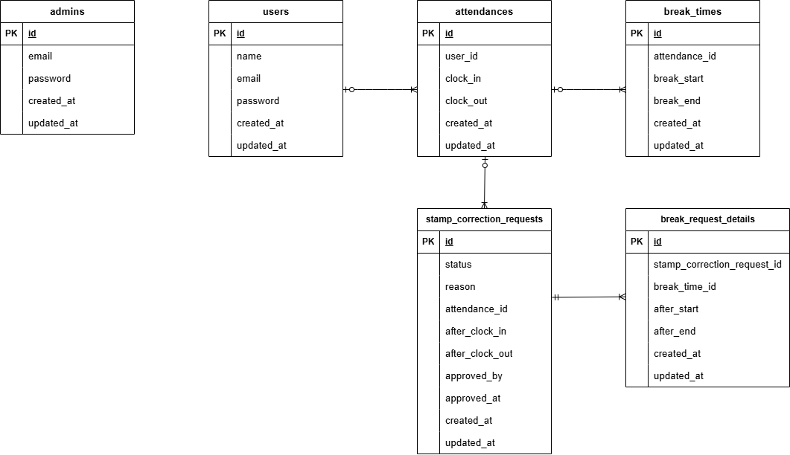

# mock-project_Attendance

## 概要
Laravelを用いて開発した勤怠アプリです。 
一般ユーザーと管理者でログイン環境を分けています。 
それぞれの異なる機能を用いて、勤怠情報の管理を行うことが可能です。 

### 機能
- 一般ユーザーの機能 
勤怠登録画面：当日の勤怠打刻を行うことができます（出勤、休憩入、休憩戻、退勤） 
勤怠一覧画面：各月の勤怠一覧を閲覧できます。基本的には当月が表示され、表示されている月に対しての前月、翌月に遷移が可能です。 
勤怠詳細画面：勤怠一覧画面の「詳細」から遷移し、該当日の勤怠詳細の確認と修正申請を行うことができます。 
申請一覧画面：勤怠詳細画面で行った修正申請（承認待ち）、管理者から承認された修正申請（承認済み）を確認することができます。 

- 管理者の機能 
勤怠一覧画面：すべての一般ユーザーの当日の勤怠状況が表示されます（勤怠していないユーザーは非表示）。詳細から各一般ユーザーの勤怠一覧画面に遷移ができます。 
勤怠詳細画面：勤怠一覧画面の「詳細」から遷移し、該当日の勤怠詳細の確認できます。管理者の場合は、勤怠を直接修正することができます。 
スタッフ一覧画面：すべての一般ユーザーの名前とメールアドレスが表示されます。 
スタッフ別勤怠一覧画面：各一般ユーザーの勤怠一覧画面です。管理者はすべての一般ユーザーの画面を閲覧とCSVダウンロードが可能です。 
申請一覧画面：すべての一般ユーザーの承認待ち修正申請、承認済み修正申請を確認することができます。 
修正申請承認画面：一般ユーザーの修正申請を承認することができます。 

- その他機能制限 
一般ユーザーの打刻は、当日のみで完結する想定で作成しており、夜勤には対応していません（NG例：当日22時に出勤、翌日6時に退勤などの日跨ぎの勤怠打刻） 
また、勤怠情報は勤怠登録画面の「出勤」ボタンをベースに作成されています。出勤処理が行われなかった日については勤怠情報が作成されていない為、修正を行うこともできません。 
管理者であっても、出勤処理が行われなかった日の勤怠情報の作成および修正はできない仕様となっています。 
修正申請については、管理者側で承認を行うことができますが、否認機能は設けていません。 

## 環境構築
※ Docker Desktop を起動した状態で以下の手順を実行してください。 

1. リポジトリをクローン 
git clone git@github.com:TakakazuSekiguchi/mock-project_Attendance.git 
cd mock-project_Attendance 
docker-compose up -d --build 

2. composer install 
docker-compose exec php composer install 

3. `.env`を作成 
cd src 
cp .env.example .env 

- docker-compose.ymlのmysqlの箇所を参考に、設定値を変更してください。 
DB_HOST=mysql 
DB_DATABASE=laravel_db 
DB_USERNAME=laravel_user 
DB_PASSWORD=laravel_pass 

※「メール認証機能の設定」については後述いたしますので、 
内容を確認し設定値を変更してください。 

4. アプリキー生成 
docker-compose exec php php artisan key:generate 

5. マイグレーション 
docker-compose exec php php artisan migrate 
docker-compose exec php php artisan db:seed 

### メール認証機能
LaravelのEmail Verification機能を利用し、会員登録時にメール認証を必須としています。 
未認証ユーザーはログイン後も一部機能にアクセスできない仕様としています。 

開発環境では Mailtrap を使用し、送信メールの動作確認を行っています。 
`.env`ファイルについて、MailtrapのMy Sandbox内にあるUsername、Passwordを確認し、ご自身の設定値に変更してください。 
※Credentials の該当箇所を確認してください。 

- Mail設定例 
MAIL_MAILER=smtp 
MAIL_HOST=sandbox.smtp.mailtrap.io 
MAIL_PORT=2525 
MAIL_USERNAME=your_username 
MAIL_PASSWORD=your_password 
MAIL_ENCRYPTION=tls 
MAIL_FROM_ADDRESS=noreply@example.com 
MAIL_FROM_NAME="${APP_NAME}" 

## 画面定義
- phpMyAdmin：http://localhost:8080/
- 会員登録画面（一般ユーザー）：http://localhost/register
- ログイン画面（一般ユーザー）：http://localhost/login
- 勤怠一覧画面（一般ユーザー）：http://attendance/list
- 勤怠詳細画面（一般ユーザー）：http://attendance/detail/{attendance}
- 申請一覧画面（一般ユーザー）：http://stamp_correction_request/list
- ログイン画面（管理者）：http://admin/login
- 勤怠一覧画面（管理者）：http://admin/attendance/list
- 勤怠詳細画面（管理者）：http://admin/attendance/{attendance}
- スタッフ一覧画面（管理者）：http://admin/staff/list
- スタッフ別勤怠一覧画面（管理者）：http://admin/attendance/staff/{user}
- 申請一覧画面（管理者）：http://stamp_correction_request/list
- 修正申請承認画面（管理者）：http://stamp_correction_request/approve/{stampCorrectionRequest}

## 使用技術（実行環境）
- PHP 8.4.12
- Laravel 8.83.29
- MySQL 8.0.26
- nginx 1.21.1
- Docker
- Mailtrap
- PHPUnit

## ER図

## テーブル設計方針
- 管理者用テーブルと一般ユーザー用テーブルを作成、config/auth.phpにてGuardを分けています。
- 勤怠情報は、勤怠テーブルと休憩テーブルに分けて処理しています。休憩テーブルを分けることで、当日の複数回の休憩処理を管理しやすくなっています。
- 当日の勤怠は「出勤」ボタンが押された際に作成され、勤怠テーブルに作られます。休憩は「休憩入」ボタンが押される度に作成され、休憩テーブルに作られます。
- 修正申請は、勤怠申請テーブルと休憩申請テーブルに分けて処理しています。休憩申請テーブルを分けることで、複数回の休憩申請処理を管理しやすくなっています。
- 修正申請は、一般ユーザーの勤怠詳細画面で「修正」ボタンが押された際に、勤怠申請と休憩申請が同時に作成されます。勤怠申請は勤怠申請テーブルに作成され、休憩申請は休憩申請テーブルに作成されます。
- 承認の処理については勤怠申請テーブルで管理しており、管理者が承認を行った際に該当の勤怠申請を更新します（承認者ID、承認対応時刻の更新）

## ログイン情報（動作確認用アカウント）

### 管理者ユーザー
- メールアドレス：admin@example.com
- パスワード：admin000

### 一般ユーザー1
- メールアドレス：user1@example.com
- パスワード：aaaa1111

### 一般ユーザー2
- メールアドレス：user2@example.com
- パスワード：bbbb2222

※ 上記アカウントは `php artisan db:seed` 実行時に作成されます。 
※ すべてのユーザーについて、メール認証済みの状態で作成されています。 

### 各ユーザーの勤怠情報、修正申請について
各ユーザーの勤怠情報については、当月＋過去3ヶ月分が作成されます（当月は昨日までの勤怠が作成されます）。 
※1日にマイグレーションを行った場合は、前月＋過去2ヶ月分の勤怠情報が作成されます。 
 
修正申請については、各ユーザーに対して以下の3つが作成されます。 
　1. 勤怠時刻の修正申請 
　2. 休憩時刻の修正申請 
　3. 勤怠漏れに対する修正申請 
※上記1～2についてはランダムな日付で作成され、3については「前月の最初の平日」を対象として作成されます。そのため、前月の最初の平日の退勤は必ずNULLになります。 
 
デフォルトで作成される修正申請は、すべて承認前のものになります。申請一覧画面の「承認待ち」タブで確認することができます。 
承認済みを確認する場合は、管理者でログイン後、申請一覧画面からいずれかの修正申請の承認処理を行ってください。 
承認処理を行うと、該当の修正申請が「承認待ち」から「承認済み」へ移動したことが確認できます。また、勤怠一覧画面と勤怠詳細画面においても、修正申請後の勤怠情報が反映されたことが確認できます。 

## テスト
Featureテスト、Unitテストを中心に実装しています。 

- 認証機能（一般ユーザー）
- ログイン認証機能（一般ユーザー）
- ログアウト機能（一般ユーザー）
- ログイン認証機能（管理者）
- ログアウト機能（管理者）
- 日時取得機能
- ステータス確認機能
- 出勤機能
- 休憩機能
- 退勤機能
- 勤怠一覧情報取得機能（一般ユーザー）
- 勤怠詳細情報取得機能（一般ユーザー）
- 勤怠詳細情報修正機能（一般ユーザー）
- 勤怠一覧情報取得機能（管理者）
- 勤怠詳細情報取得・修正機能（管理者）
- ユーザー情報取得機能（管理者）
- 勤怠情報修正機能（管理者）
- メール認証機能（一般ユーザー）

### テスト環境構築
1. データベースを作成 
- rootユーザーで MySQL にログイン 
docker compose exec mysql bash 
mysql -u root -p 
※パスワードは、docker-compose.ymlファイルのMYSQL_ROOT_PASSWORD:に設定されている値を入力してください。 

- demo_test というデータベースを作成 
CREATE DATABASE demo_test; 
SHOW DATABASES; 
※SHOW DATABASES;入力後、demo_testが作成されていれば成功です。 

2. `.env` をコピーして `.env.testing` を作成 
cd src 
cp .env .env.testing 

3. `.env.testing` のAPP_ENVとAPP_KEY=を以下のように変更 
APP_ENV=test 
APP_KEY= 

※ APP_KEYはテスト用に再生成するため、一度空にしてください。 
その後、後述のコマンド（key:generate）でテスト用キーを生成します。 

4. `.env.testing` のDB設定を以下のように変更 
DB_CONNECTION=mysql_test 
DB_DATABASE=demo_test 
DB_USERNAME=root 
DB_PASSWORD=root 

※【重要】本番用データベースと分離するため、テスト専用DBを使用しています。 
必ず『DB_DATABASE=demo_test』に書き換えるようお願いいたします。 

### テスト用データベースを作成
docker-compose exec php php artisan key:generate --env=testing 
docker-compose exec php php artisan migrate:fresh --env=testing 

### テスト実行
docker-compose exec php php artisan test 

※ テストでは RefreshDatabase を使用し、各テスト実行ごとにDBをリセットしています。 

